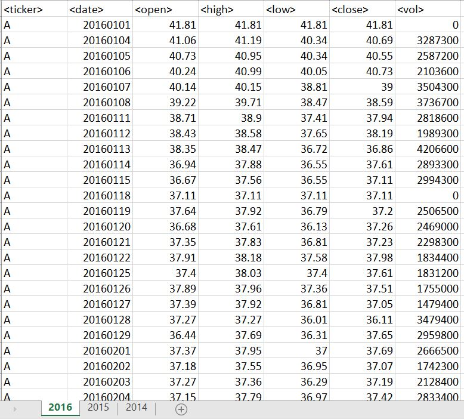
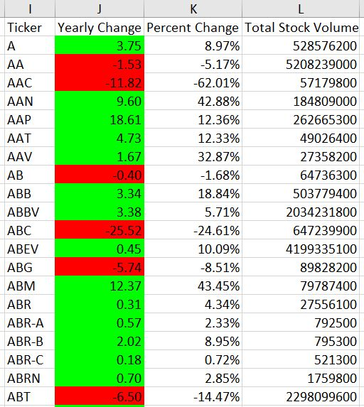
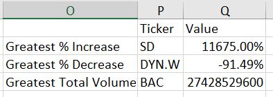

# VBA-Challenge

Use VBA to analyze stock market data 

VBA script description:

  * Loop through all the stocks for one year and output the following information.

  * The ticker symbol.

  * Yearly change from opening price at the beginning of a given year to the closing price at the end of that year.

  * The percent change from opening price at the beginning of a given year to the closing price at the end of that year.

  * The total stock volume of the stock.

  * Use conditional formatting to highlight positive change in green and negative change in red.

# VBA - Stock Market Data Analysis

## About The Project

* Use VBA scripting to analyze real stock market data.

### Built With

* VBA 

### Dataset

* "Multiple_year_stock.xlsx" in the foloder "dataset"
* There are 3 sheets with the data in 2016, 2015 and 2014

## Procedures

### 1. Loop through all the stocks for one year and output the following information.

* The ticker symbol.
* Yearly change from opening price at the beginning of a given year to the closing price at the end of that year.
* The percent change from opening price at the beginning of a given year to the closing price at the end of that year.
* The total stock volume of the stock.

### 2. Highlight positive change in green and negative change in red.

### 3. Return the stock with the "Greatest % increase", "Greatest % decrease" and "Greatest total volume".

### 4. Run on every worksheet.

### 5. Final result can be found in "Multiple_year_stock_data.xlsm"

